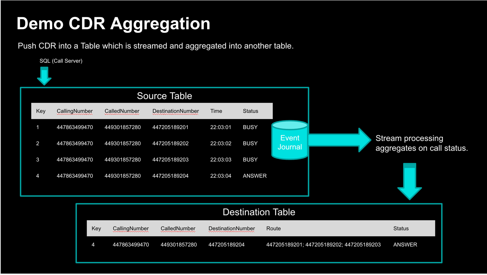

# CDR Aggregation Demo
The idea of the demo is to introduce the idea of CDR post-processing of CDR streams coming out of Call servers.
We would create a `Pipeline` that reads from a Map Journal, applies stateful transformation and then pushes an aggregated
CDR into another Map.

Scenario: A calling number is dialing the called number but the call server is actually connecting the caller to a 
real destination number. In the first three attempts the destination numbers are busy but the 4th attempt answers and 
call server connects the calling number to this 4th destination. The final CDR sent to mediation should be the one
connected to this 4th destination number but the final cdr should mention other three destinations as well. 

## Deployment
- Start one or more Hazelcast members `hz start` and also Management Center `hz-mc start`
- Compile and package `./gradlew build` the code which has the `Pipeline`
- Deploy the jar to the cluster `hz-cli submit --class com.hazelcast.examples.cdr.CDRRead  build/libs/cdrstreaming-1.0-SNAPSHOT.jar`
## Demo steps
You can demo the SQL in Management Center or any other SQL client. I used DBeaver.
- Create the Mapping for the Maps
```roomsql
CREATE OR REPLACE MAPPING "cdr" (
  __key VARCHAR,
  "ID" VARCHAR EXTERNAL NAME "this.ID",
  "calledNumber" VARCHAR EXTERNAL NAME "this.calledNumber",
  "callingNumber" VARCHAR EXTERNAL NAME "this.callingNumber",
  "destinationNumber" VARCHAR EXTERNAL NAME "this.destinationNumber",
  "route" VARCHAR EXTERNAL NAME "this.route",
  "status" VARCHAR EXTERNAL NAME "this.status",
  "time" VARCHAR EXTERNAL NAME "this.time" )
TYPE IMap OPTIONS ( 'keyFormat' = 'java',
  'keyJavaClass' = 'java.lang.String',
  'valueFormat' = 'compact',
  'valueCompactTypeName' = 'com.hazelcast.examples.cdr.CDR' );
---
CREATE OR REPLACE MAPPING "cdr-final" (
  __key VARCHAR,
  "ID" VARCHAR EXTERNAL NAME "this.ID",
  "calledNumber" VARCHAR EXTERNAL NAME "this.calledNumber",
  "callingNumber" VARCHAR EXTERNAL NAME "this.callingNumber",
  "destinationNumber" VARCHAR EXTERNAL NAME "this.destinationNumber",
  "route" VARCHAR EXTERNAL NAME "this.route",
  "status" VARCHAR EXTERNAL NAME "this.status",
  "time" VARCHAR EXTERNAL NAME "this.time" )
TYPE IMap OPTIONS ( 'keyFormat' = 'java',
  'keyJavaClass' = 'java.lang.String',
  'valueFormat' = 'compact',
  'valueCompactTypeName' = 'com.hazelcast.examples.cdr.CDR' );  
```
- Now add three CDR to the `cdr` map using SQL. Each entry will trigger the Pipeline but it would not generate the final CDR as it is waiting for the `ANSWER` status CDR.
```roomsql
sink into cdr  values ('1', '1','447863499470', '449301857280', '447205189201', '', 'BUSY', '2020-10-10 10:10:00');
sink into cdr values ('2', '2','447863499470', '449301857280', '447205189202', '', 'BUSY', '2020-10-10 10:15:00');
sink into cdr values ('3', '3','447863499470', '449301857280', '447205189203', '', 'BUSY', '2020-10-10 10:20:00');
```
- You can now see the records in the `cdr` map and also in the `cdr-final` map. The `cdr-final` map is empty.
```roomsql
SELECT * FROM cdr;
SELECT * FROM "cdr-final";
```
- Now add the 4th CDR to the `cdr` map with status `ANSWER`. This will trigger the Pipeline and generate the final CDR.
```roomsql
sink into cdr values ('4', '4','447863499470', '449301857280', '447205189204', '', 'ANSWERED', '2020-10-10 10:25:00');
```
- Now when you query the `cdr-final` map you will see the final CDR with all `BUSY` destinations as `route`.
